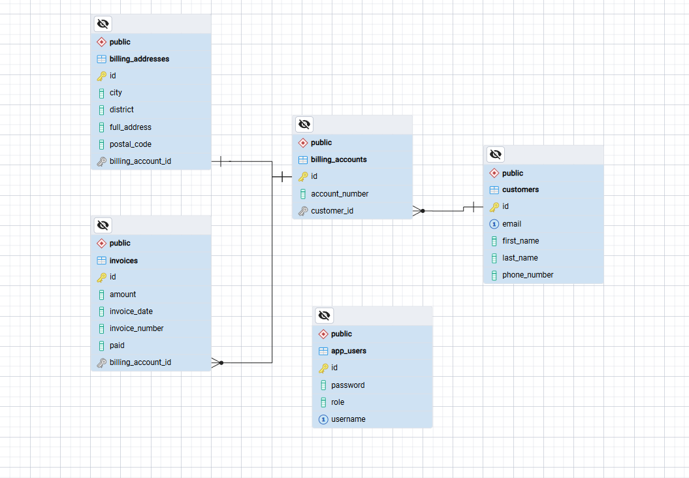

# Müşteri Faturalama Sistemi

Hacettepe Teknokent'te NISH Business Solutions bünyesinde gerçekleştirilen staj kapsamında geliştirilen, Spring Boot tabanlı bir müşteri faturalama REST API'sidir.

## Teknolojiler

- Java 17
- Spring Boot
- Spring Data JPA / Hibernate
- Spring Security + JWT
- PostgreSQL
- Lombok

## ER Veri Modeli



## Özellikler

- Müşteri, hesap, adres ve fatura yönetimi (CRUD)
- JWT tabanlı kimlik doğrulama
- DTO katmanı ile güvenli veri transferi
- Merkezi hata yönetimi
- Bean Validation ile giriş doğrulama

## API Dokümantasyonu

Tüm endpoint'ler (auth hariç) JWT token gerektirir. Token, `Authorization: Bearer <token>` header'ı ile gönderilmelidir.

### Kimlik Doğrulama

#### Kayıt Ol

POST /api/auth/register

Request Body:

{
"username": "melih",
"password": "sifre123",
"role": "ADMIN"
}

Response (200):

{
"id": 1,
"username": "melih",
"role": "ADMIN"
}

#### Giriş Yap

POST /api/auth/login

Request Body:

{
"username": "melih",
"password": "sifre123"
}

Response (200):

{
"token": "eyJhbGciOiJIUzI1NiJ9..."
}

---

### Müşteri (Customer) Endpoint'leri

| Metod | Endpoint | Açıklama |
|---|---|---|
| POST | /api/customers | Yeni müşteri oluştur |
| GET | /api/customers | Tüm müşterileri listele |
| GET | /api/customers/{id} | Müşteriyi ID ile getir |
| PUT | /api/customers/{id} | Müşteriyi güncelle |
| DELETE | /api/customers/{id} | Müşteriyi sil |

Örnek Request Body (POST/PUT):

{
"firstName": "Ahmet",
"lastName": "Yılmaz",
"email": "ahmet@example.com",
"phoneNumber": "05551234567"
}

Örnek Response:

{
"id": 1,
"firstName": "Ahmet",
"lastName": "Yılmaz",
"email": "ahmet@example.com",
"phoneNumber": "05551234567"
}

---

### Hesap (Billing Account) Endpoint'leri

| Metod | Endpoint | Açıklama |
|---|---|---|
| POST | /api/customers/{customerId}/billing-accounts | Müşteriye bağlı yeni hesap oluştur |
| GET | /api/billing-accounts | Tüm hesapları listele |
| GET | /api/billing-accounts/{id} | Hesabı ID ile getir |
| PUT | /api/billing-accounts/{id} | Hesabı güncelle |
| DELETE | /api/billing-accounts/{id} | Hesabı sil (bağlı adres ve faturalar da silinir) |

Örnek Request Body:

{
"accountNumber": "ACC-1001"
}

Örnek Response:

{
"id": 1,
"accountNumber": "ACC-1001",
"customerId": 1
}

---

### Fatura Adresi (Billing Address) Endpoint'leri

| Metod | Endpoint | Açıklama |
|---|---|---|
| POST | /api/billing-accounts/{billingAccountId}/address | Hesaba bağlı adres oluştur |
| GET | /api/billing-addresses | Tüm adresleri listele |
| GET | /api/billing-addresses/{id} | Adresi ID ile getir |
| PUT | /api/billing-addresses/{id} | Adresi güncelle |
| DELETE | /api/billing-addresses/{id} | Adresi sil |

Örnek Request Body:

{
"city": "Ankara",
"district": "Çankaya",
"fullAddress": "Teknokent Cad. No:5",
"postalCode": "06800"
}

Örnek Response:

{
"id": 1,
"city": "Ankara",
"district": "Çankaya",
"fullAddress": "Teknokent Cad. No:5",
"postalCode": "06800",
"billingAccountId": 1
}

---

### Fatura (Invoice) Endpoint'leri

| Metod | Endpoint | Açıklama |
|---|---|---|
| POST | /api/billing-accounts/{billingAccountId}/invoices | Hesaba bağlı fatura oluştur |
| GET | /api/invoices | Tüm faturaları listele |
| GET | /api/invoices/{id} | Faturayı ID ile getir |
| PUT | /api/invoices/{id} | Faturayı güncelle |
| DELETE | /api/invoices/{id} | Faturayı sil |

Örnek Request Body:

{
"invoiceNumber": "INV-2026-001",
"invoiceDate": "2026-08-28",
"amount": 149.90,
"paid": false
}

Örnek Response:

{
"id": 1,
"invoiceNumber": "INV-2026-001",
"invoiceDate": "2026-08-28",
"amount": 149.90,
"paid": false,
"billingAccountId": 1
}

---

### Hata Yanıt Formatı

Tüm hatalar, aşağıdaki standart formatta döner:

{
"timestamp": "2026-08-28T10:23:57.644",
"status": 404,
"message": "Müşteri bulunamadı: 999",
"path": "uri=/api/customers/999"
}

| Durum | HTTP Kodu |
|---|---|
| Kayıt bulunamadı | 404 |
| Yanlış kullanıcı adı/şifre | 401 |
| Geçersiz veri (validation) | 400 |
| Beklenmeyen hata | 500 |

## Docker ile Çalıştırma

Proje, Docker ve docker-compose ile tek komutla ayağa kaldırılabilir. Ekstra bir Java veya PostgreSQL kurulumu gerekmez.

### Gereksinimler

- Docker Desktop kurulu ve çalışır durumda olmalı

### Çalıştırma

Proje kök dizininde şu komutu çalıştırın:

```bash
docker-compose up --build
```

Bu komut:
- PostgreSQL veritabanını bir container içinde başlatır
- Uygulamayı Dockerfile üzerinden derleyip başka bir container içinde çalıştırır
- İki container'ı aynı Docker ağında birbirine bağlar

Uygulama ayağa kalktıktan sonra `http://localhost:8080` üzerinden erişilebilir.

### Durdurma

```bash
docker-compose down
```

### Not

Docker ortamındaki veritabanı, yerel (native) PostgreSQL kurulumundan bağımsız ve boş başlar. Docker container'ı her yeniden oluşturulduğunda veritabanı sıfırdan gelir.